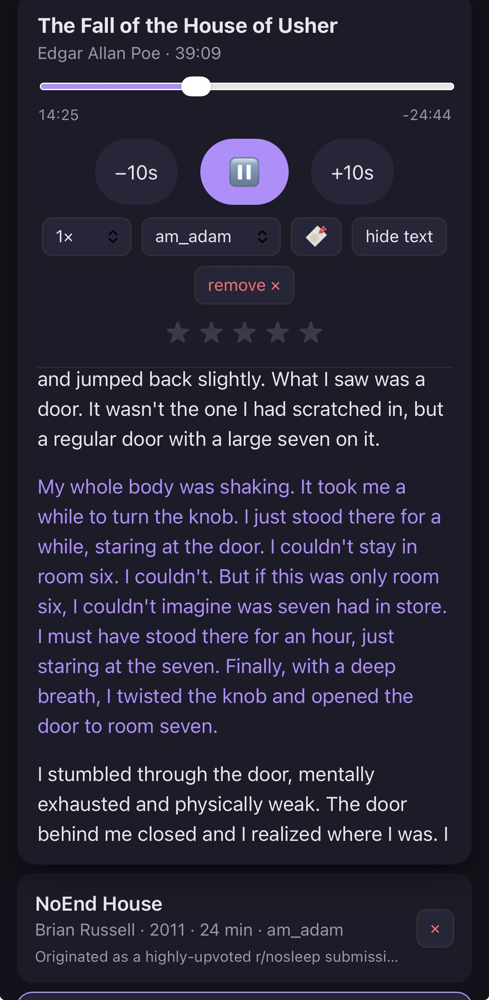
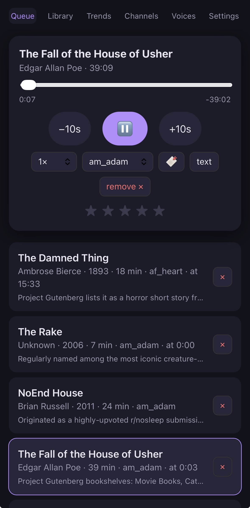
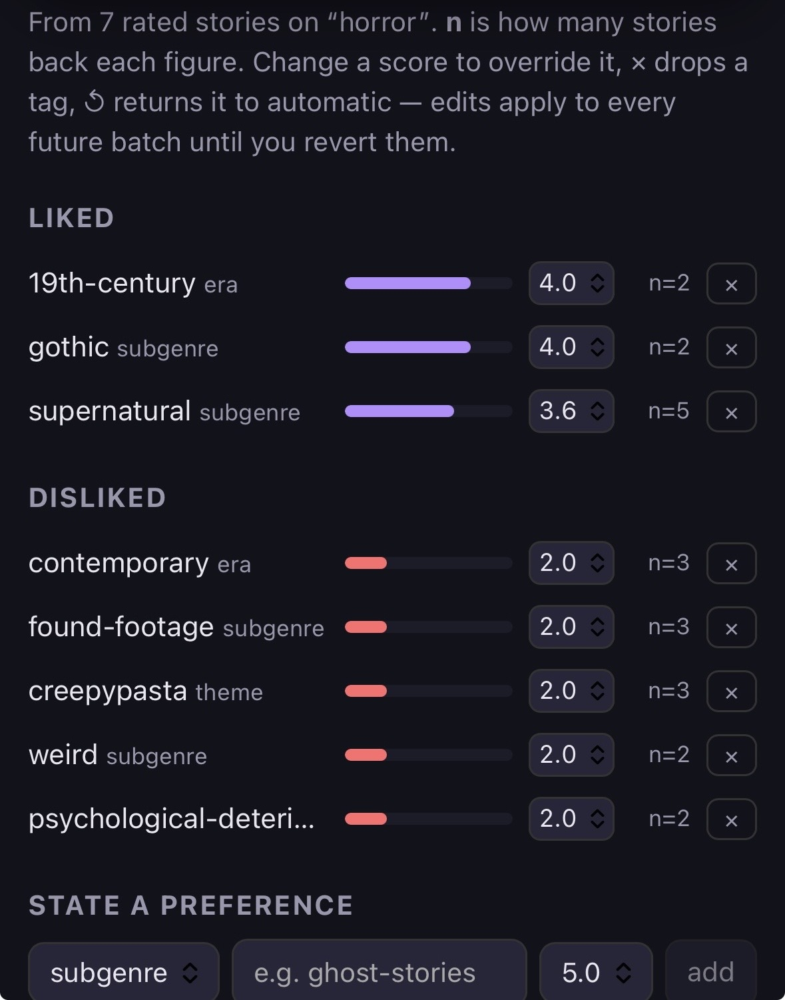

# infinite_audiobook

A self-hosted read-aloud fiction library, built for one listener.

An LLM curates highly-reputed short fiction against editable channel criteria (genre,
language, topic — the default channel is classic + modern horror); a pipeline fetches the
text and cleans it; local text-to-speech narrates it paragraph by paragraph; and a React PWA
plays it back with the text scrolling in sync with the audio, resume positions that survive
killing the browser, and 1–5 ratings that feed back into what gets curated next. It keeps a
standing queue of three unread stories and refills itself. It runs on one Mac and is reached
from a phone over Tailscale — it is not a hosted service and there is no demo.

**Built with Claude Code, under a phase-gated process.** Directing a model and then verifying
what it produced is the work; the interesting part of this repo is the machinery that makes
the verification real. Every phase has a written gate, and a phase does not close until the
gate is answered with a command and its output. When a gate turned out to be wrong, it was
re-opened rather than argued away — the worked example is
[the Phase 6 case study](#case-study-the-gate-that-caught-its-own-false-pass) below. The
governance stack is in the open: [`CLAUDE.md`](CLAUDE.md) (standing rules),
[`STATE.md`](STATE.md) (pure current state, no history), [`JOURNAL.md`](JOURNAL.md)
(append-only and reverse-chronological — corrections are new entries, never edits; Entries
34–38 are the ones to read first), [`TASKS.md`](TASKS.md), and
[`docs/AMENDMENT_*.md`](docs/) for scope changes that contradict a frozen design.

<!-- SCREENSHOTS: drop 3–4 PNGs into docs/screenshots/ and uncomment. Shot list:
     player with text-follow highlighting mid-story · queue at 3/3 · Trends/taste screen ·
     channel editor. Plus a ~60s screen recording.
## Screenshots
| | |
|---|---|
|  |  |
|  |  |
-->

## Architecture

| layer | choice |
|---|---|
| Pipeline | Python 3.12 — `curate → fetch → clean → synthesize`, each stage independently runnable |
| Server | FastAPI + SQLite (WAL); all state is the DB plus `data/library/` on disk |
| Frontend | React + Vite PWA, built to static files and served by FastAPI |
| TTS | **Kokoro** locally for English and French (free, runs faster than realtime on the CPU) · **edge-tts** for Chinese · **OpenAI TTS** as a per-story fallback |
| Curation | Anthropic Messages API with web search and prompt caching — or a **$0** path (below) |
| Network | binds the Tailscale interface only, never `0.0.0.0` |

Two details that carry most of the product:

- **Audio is synthesized per paragraph and concatenated**, so the byte offsets of each chunk
  are known exactly. That is what powers text↔audio sync — the highlighting is computed from
  the offsets manifest, not estimated from a duration.
- **Curation has three cost modes**, chosen in Settings. `llm` uses paid web search and is the
  expensive path. `free` uses a registry of sources that *declare which channels they cover* —
  the Gutenberg catalog, curated wiki categories — and makes no model call at all; if no
  registered source covers the active channel it stops and names the reasons rather than
  silently falling back to the paid path. `free_llm` sits between them: free sourcing, one
  cheap model call to rank candidates against the taste profile. Building the registry took
  routine curation off paid search entirely. *(Per-build cost figures live in
  `docs/REPORTABLE_NUMBERS.md` and are currently marked UNVERIFIED there, so they are not
  quoted here.)* A rolling spend cap is enforced before every paid **curation** path,
  including the cheap one — a guard that covers only the expensive path is how the cheap path
  becomes the leak. Two paid calls sit outside the cap by documented choice, pending a design
  ruling: tagging at ingest and the per-story TTS fallback.
  [`pipeline/budget.py`](pipeline/budget.py) says so in as many words rather than rounding
  itself up to "every".

Design rules worth naming, because they came from failures: time-dependent logic takes `now`
as a parameter (so it can be tested); every serialized shape has a `decode(encode(x)) == x`
round-trip test; constants are centralized on the *second* copy, not the third; and the
definition of "working" is the phone over Tailscale, never desktop localhost.

## Tests

**285 tests, all passing at commit `f1394e9`** — the count is not maintained by hand; the
same committed script derives it and every other repo-scale figure:

```
bash scripts/repo_stats.sh
```

They cover pure logic — chunk-offset math, queue replenishment, resume/progress, rating
aggregation, serialization round-trips — plus the FastAPI routes. They deliberately do **not**
cover the TTS engines, live API calls, or iOS Safari playback; those are gated by
phone-over-Tailscale tests recorded in `JOURNAL.md`, because a green suite is not a claim that
the system works end to end.

Any number that leaves this project passes the six-gate procedure in
[`docs/REPORTABLE_NUMBERS.md`](docs/REPORTABLE_NUMBERS.md) first. That ledger exists because a
figure quoted from a document that quotes another document is not a measurement — and writing
it caught a stale line count that had already been drafted into an application.

## Case study: the gate that caught its own false pass

Phase 6 makes curation respond to my ratings. Its gate produced the best evidence in this
repo of what the process is for. The short version, in order — the long version is the dated
primary record in [`JOURNAL.md`](JOURNAL.md), Entries 34–38:

**A control run did the real work.** The gate was an A/A′/B design: run curation twice with
*no* taste profile, to measure how much two runs differ by chance alone, then once with it.
The first attempt's effect was **smaller than its own noise floor** — a result that would
have read as a modest success if only A and B had been run *(Entry 34)*. After a fix to the
source-class quotas it passed cleanly at batch size 12: noise 1 title, effect 8, and the
profile took Lovecraft from 7 of 12 picks to 0, matching a strongly negative rating on the
`weird` subgenre *(Entry 35)*.

**Production broke it.** The gate had run at batch 12; production runs at 40 — and the first
real build took **11 of 12** Lovecraft titles. The innocent explanations were checked and all
failed. The mechanism: a profile reorders the top of a ranking, but filling 40 slots reaches
deep enough down it that one strong dislike stops being decisive *(Entry 37)*.

**Then the finding inverted.** I actually like cosmic horror — the `weird 1.0/5` driving the
whole effect came from *one badly-made story*, not from the genre, so the profile's content
was wrong and the model's plain reputation ranking had been closer to right. The tempting fix
— make the profile bite harder — would have shipped the defect faster. The root cause was a
missing per-tag evidence floor: nothing stopped a single rating from becoming a 1.0/5 verdict
on an entire subgenre. Adding the floor made the profile honest and much thinner, cutting it
from 16 reported tags to 5 *(Entry 38)*. The half no floor can fix is recorded as a design
decision rather than quietly patched: a 1–5 rating conflates "this story was badly made" with
"I dislike this kind of story", and separating them needs a second signal from the player.

**Phase 6 is published RE-OPENED**, awaiting a re-gate at batch 40. That status is on
purpose: a gate that says *this does not hold at production scale* is worth more than one
that claims to be finished.

## Content rights

**No story text and no audio is in this repository, and none ever has been.** `data/` is
gitignored, and `git log --all --diff-filter=A` confirms no path under `data/` or matching
`.env` was ever added in any commit on any branch — the check is part of
`scripts/repo_stats.sh` and fails loudly.

Classic works are sourced from Project Gutenberg and are public domain. Modern web fiction
remains the property of its authors and is fetched, stored, and narrated **for private
listening on one machine only**. Nothing is redistributed, nothing is served publicly, and the
app binds a Tailscale interface rather than a public one. The [LICENSE](LICENSE) covers the
code in this repository; it grants nothing in the fiction the pipeline fetches.

## Status

| phase | status |
|---|---|
| 0 — Scaffold | gate passed |
| 1 — Pre-design probes | gate passed |
| 2 — Design (frozen) | gate passed |
| 3 — Pipeline MVP | gate passed |
| 4 — Player MVP | gate passed (full listen on phone over Tailscale) |
| 5 — Queue, sync, channels | gate passed |
| 6 — Preference adaptation | **RE-OPENED** — passed at batch 12, does not describe production at batch 40 |
| 7 — Hardening | in progress — runbook written, cold-start test still owed |

[`STATE.md`](STATE.md) is the live version of this table and is always more current than this
README.

## Running it

Full instructions: [`docs/RUNBOOK.md`](docs/RUNBOOK.md) → **Cold start**.

Be aware of the real cost of entry before you start: **macOS**, a Python 3.12 venv that pulls
~2 GB of torch for local TTS, Node for the frontend build, an Anthropic key (an OpenAI key is
optional — it is only the TTS fallback), and Tailscale signed in on two devices. This is a
personal system that happens to be readable, not a project designed to be installed by
strangers. The runbook also covers key rotation, backup and restore, the launchd scheduler,
and a troubleshooting table.
